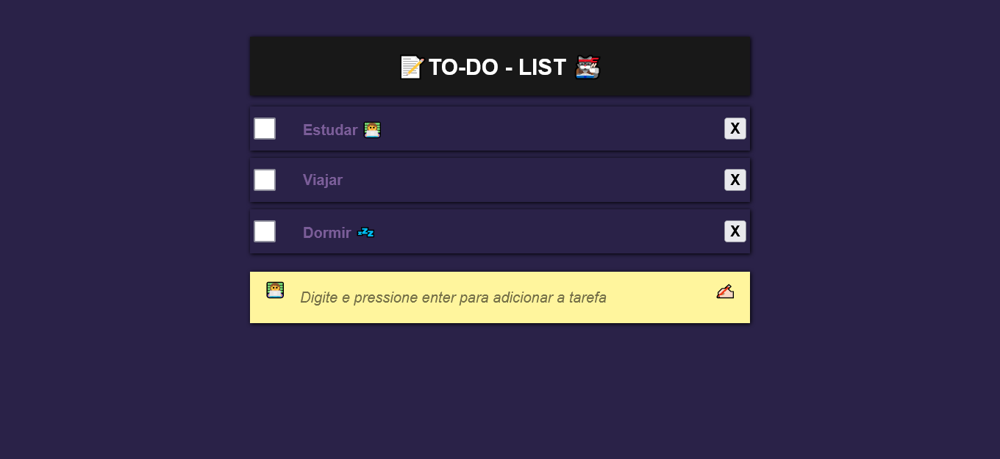

<h1 align="center"> 📝To-do-list🐱‍👓</h1>
<p align="center"> A famosa To-do list (Lista de tarefas) feito com html, css e js para treinar todos os seus conceitos e por em pratica alguns conhecimentos em JS </p>

<div align='center'>
  <div>
    
  </div>
  <div> 
   
   ## 🤔 Como usar ?

```
Clone o projeto com $ git clone https://github.com/nome_do_usuario/repositorio.git
Abra a pasta do projeto em seu editor de código preferido
Abra o index.html no seu navegador   
Prontinho!   
```
   
## 📝 Licença

Esse projeto está sob licença do MIT.
